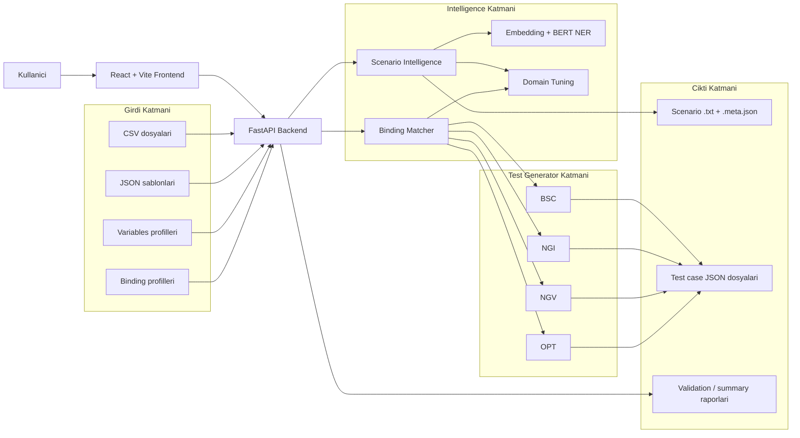
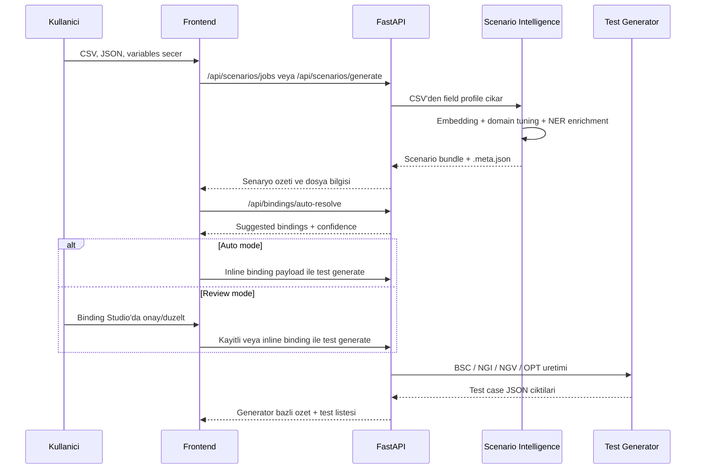
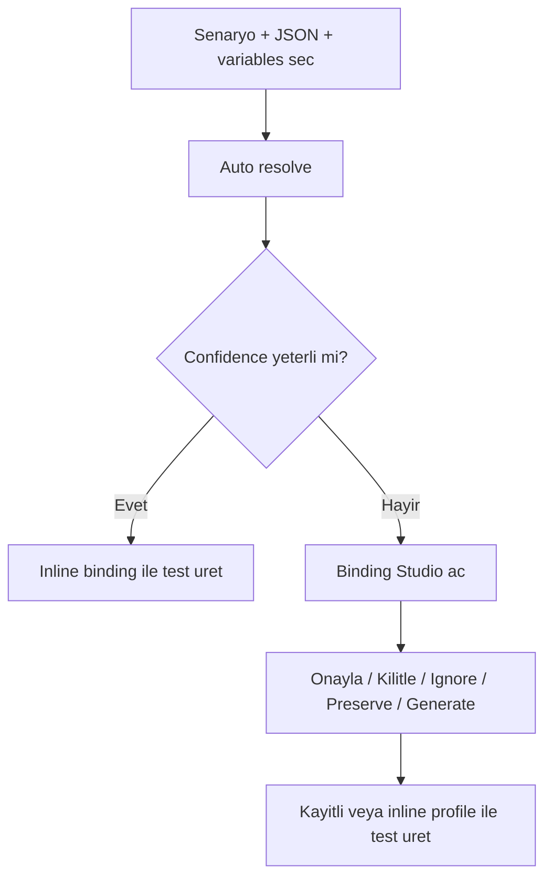

# TestGen AI

TestGen AI, CSV tabanli is kurallarindan test senaryosu ureten, bu senaryolari JSON sablonlari ve variables profilleri ile eslestiren, ardindan `BSC`, `NGI`, `NGV` ve `OPT` test materyali olusturan NLP destekli bir test uretim platformudur.

- Repo: [Atakan-Emre/TestGen-AI](https://github.com/Atakan-Emre/TestGen-AI)
- Frontend demo: [atakan-emre.github.io/TestGen-AI](https://atakan-emre.github.io/TestGen-AI/)
- Lokal frontend: [http://localhost:5173](http://localhost:5173)
- Lokal backend: [http://localhost:8000](http://localhost:8000)
- Health: [http://localhost:8000/health](http://localhost:8000/health)

## Icindekiler

1. [Urun Ozet](#urun-ozet)
2. [Ne Cozer](#ne-cozer)
3. [Mimari Genel Bakis](#mimari-genel-bakis)
4. [Uctan Uca Calisma Akisi](#uctan-uca-calisma-akisi)
5. [Temel Yetenekler](#temel-yetenekler)
6. [NLP ve Hybrid Matching Katmani](#nlp-ve-hybrid-matching-katmani)
7. [Veri Beklentileri ve Sozlesmeler](#veri-beklentileri-ve-sozlesmeler)
8. [Klasor Yapisi](#klasor-yapisi)
9. [Lokal Kurulum](#lokal-kurulum)
10. [Docker Topolojileri](#docker-topolojileri)
11. [GitHub Pages Demo ve Yayin Akisi](#github-pages-demo-ve-yayin-akisi)
12. [Ana API Gruplari](#ana-api-gruplari)
13. [Kalite ve Test Stratejisi](#kalite-ve-test-stratejisi)
14. [Operasyonel Notlar](#operasyonel-notlar)
15. [Beklentiler ve Yol Haritasi](#beklentiler-ve-yol-haritasi)

## Urun Ozet

TestGen AI'nin odagi yalnizca test dosyasi yazmak degildir. Sistem su zinciri tek bir urun akisi icinde yonetir:

1. CSV'den alan profilleri cikarir.
2. Bu alan profillerinden senaryo metni ve yapilandirilmis metadata olusturur.
3. JSON sablonundaki alanlari variables ve semantic skorlarla eslestirir.
4. Gerekiyorsa Binding Studio ile insan onayi alir.
5. BSC, NGI, NGV ve OPT tiplerinde test case setleri uretir.
6. Uretilen testleri aciklama, beklenen sonuc ve dosya bazinda listeletir.

Bu nedenle TestGen AI bir "test case generator" olmanin otesinde, `scenario intelligence + schema matching + controlled test generation` platformudur.

Repo ornekleri bilincli olarak korunur:

- ornek girdiler: `data/input/Csv`, `data/input/Json`, `data/input/Variables`
- sabit ornek ciktılar: [data/output/repo_samples](/Users/atakanemre/Downloads/test_project-main/data/output/repo_samples)

## Ne Cozer

Kurumsal ekiplerde su sorunlar sik gorulur:

- Alan kurallari CSV veya Excel gibi yari-yapisal dosyalarda tutulur.
- API payload sablonlari JSON dosyalarinda yasar.
- Environment degerleri farkli variables dosyalarina dagilir.
- Test muhendisleri ayni dogrulamalari manuel olarak tekrar tekrar kurar.
- Negatif testler alan tipine gore tutarli uretilemez.
- Semantik olarak benzer ama farkli isimli alanlar dogru eslestirilemez.

TestGen AI bu boslugu su sekilde kapatir:

- CSV alan bilgisini senaryo ve constraint setine cevirir.
- JSON alanlarini semantik, type-aware ve domain-aware mantikla analiz eder.
- Variables baglama, preserve, ignore, force-null ve generate politikalarini destekler.
- Negatif testleri alan tipine gore kontrollu uretir.
- Gozden gecirme gerektiren binding alanlarini confidence ile isaretler.

## Mimari Genel Bakis



## Uctan Uca Calisma Akisi



## Temel Yetenekler

| Alan | Aciklama |
| --- | --- |
| Senaryo uretimi | CSV alan tanimlarindan otomatik scenario line ve metadata bundle olusturur |
| NLP enrichment | Alan tipi, semantic tag ve entity sinyallerini embedding ve NER ile zenginlestirir |
| Dynamic binding | Variables eslestirmesini confidence ile onerir, gerekirse review acisi saglar |
| Binding Studio | `bind`, `preserve`, `ignore`, `force_null`, `generate` aksiyonlarini yonetir |
| BSC | Pozitif ve zorunlu alan odakli temel gecerli payload uretir |
| NGI | Tip ihlali, semantik uyumsuzluk ve invalid input senaryolari uretir |
| NGV | Sinir deger, duplicate ve invalid value varyasyonlari uretir |
| OPT | Opsiyonel alan yoklugu veya alternatif kombinasyon testleri uretir |
| Test listesi | JSON dosyasini acmadan aciklama ve beklenen sonuc goruntuler |
| Dashboard | Girdi/cikti sayilari, son scenario ve test paketlerini ozetler |

## NLP ve Hybrid Matching Katmani

### Neden hybrid yaklasim?

Bu proje yalnizca pure rule-based ya da pure LLM/NLP degildir. Mevcut sistem bilincli olarak hybrid tasarlandi:

- Kural tabanli katman deterministik davranis saglar.
- Domain-aware tuning, finans/evrak/cari benzeri alan adlarinda daha dogru tip karari verir.
- Embedding katmani adlar birbirine tam benzemese de semantik yakinligi yakalar.
- BERT NER, serbest metin sinyallerini ve entity enrichment tarafini destekler.
- Binding Studio son karari insana birakabildigi icin sistem audit edilebilir kalir.

### Aktif NLP bilesenleri

| Bilesen | Teknoloji | Nerede kullaniliyor |
| --- | --- | --- |
| Embedding modeli | `sentence-transformers/paraphrase-multilingual-MiniLM-L12-v2` | Alan adi, aciklama ve tip prototipleri arasindaki semantik yakinlik |
| NER pipeline | `dbmdz/bert-large-cased-finetuned-conll03-english` | Alan isimleri ve kaynak metinlerde entity enrichment |
| Domain tuning | Ozel token, tip alias ve semantik tag kurallari | `id`, `date`, `enum`, `string`, `number` ayrimi ve domain tag cikarma |
| Binding scoring | Token overlap + type compatibility + context scoring | JSON path -> variable key onerisi |
| Legacy NLP runtime | `spaCy` + `spaCy Transformers` | Legacy/shared runtime ve genisleme alani |

### NLP akisi nasil calisir?

1. CSV okunur.
2. Satir bazinda alan isimleri, tip, boyut, required ve unique bilgileri toplanir.
3. Domain tuning once hizli karar dener.
4. Gerekirse embedding prototipleri ile alan tip skoru hesaplanir.
5. BERT NER pipeline alan adlarindan ek entity sinyali cikarir.
6. Her alan icin `ScenarioFieldProfile` uretilir.
7. Profillerden hem insan okunur senaryo satirlari hem de `.meta.json` sidecar olusturulur.

### Binding karar mantigi

Binding akisi statik dosya bagimliligi ile sinirli degildir. Sistem artik:

- inline binding payload kabul eder
- kayitli binding profile kabul eder
- review mode ve auto mode'u ayri yonetir
- silinmis `BindingProfiles` klasorunu yeniden olusturabilir

Binding confidence mantigi genel olarak su sinyalleri birlestirir:

- exact path match
- leaf token uyumu
- context token uyumu
- type compatibility
- generic token filtreleme
- domain-aware key yorumlama

### Auto vs Review akisi



## Veri Beklentileri ve Sozlesmeler

### 1. CSV beklentisi

Sistem en saglikli sonucu su kolonlar oldugunda verir:

| Kolon | Amac |
| --- | --- |
| `Alan adı (İng)` | Alanin teknik veya API ismi |
| `Tip` | `string`, `numeric`, `date`, `enum`, `boolean` benzeri tip bilgisi |
| `Boyut` | Min / max uzunluk veya boyut ipucu |
| `Zorunlu mu?` | Required / optional bilgisi |
| `Tekil mi?` | Unique constraint |
| `Öndeğer` | Enum veya pattern sinyali icin yardimci veri |

Repo ile gelen ornek dosyalar:

- [example.csv](/Users/atakanemre/Downloads/test_project-main/data/input/Csv/example.csv)
- [Example-Header.json](/Users/atakanemre/Downloads/test_project-main/data/input/Json/Example-Header.json)
- [Example-Line.json](/Users/atakanemre/Downloads/test_project-main/data/input/Json/Example-Line.json)
- [variablesHeader.txt](/Users/atakanemre/Downloads/test_project-main/data/input/Variables/variablesHeader.txt)
- [variablesLine.txt](/Users/atakanemre/Downloads/test_project-main/data/input/Variables/variablesLine.txt)

### 2. Variables profilleri

Variables su formatlarda tutulabilir:

- `.txt`
- `.json`
- `.yaml`
- `.yml`

TXT formatinda ornek:

```ini
financeCardType=CUSTOMER
user.id=jplatformuser Admin
branchDocumentSeries.id=28052c8b-15a8-46d9-ba7f-86b848c60c3e
cardCurrencyDescription.id=a1af9bc0-8d79-4004-9298-8e720442e57a
```

### 3. Scenario bundle sidecar yapisi

Her senaryo dosyasina ek olarak `.meta.json` sidecar uretilir.

Ornek:

```json
{
  "scenario_name": "test",
  "source_csv": "<input_csv_name>.csv",
  "generator_type": "nlp_hybrid",
  "generated_at": "<iso_datetime>",
  "scenario_file": "<scenario_name>_<timestamp>.txt",
  "fields": [
    {
      "field_name_tr": "Belge Tarihi",
      "field_name_en": "documentDate",
      "field_type": "date",
      "required": true,
      "optional": false,
      "unique": false,
      "max_len": null,
      "min_len": null,
      "pattern": null,
      "enum_values": [],
      "semantic_tags": ["document", "date"],
      "ner_entities": [],
      "scenario_lines": [
        "Belge Tarihi (documentDate) alanı geçerli bir tarih formatında olmalıdır.",
        "Belge Tarihi (documentDate) alanı doldurulması zorunludur."
      ],
      "confidence": 0.98
    }
  ]
}
```

### 4. Binding profile yapisi

Kayitli profile veya inline payload asagidaki mantikla calisir:

```json
{
  "name": "binding_auto_<json_template>_<variables_profile>",
  "json_file_id": "<json_file_id>",
  "variables_profile": "<variables_profile>",
  "description": "Otomatik olusturulmus binding profili",
  "bindings": [
    {
      "json_path": "user.id",
      "schema_type": "id",
      "suggested_variable_key": "user.id",
      "variable_key": "user.id",
      "confidence": 1.0,
      "status": "matched",
      "action": "bind",
      "locked": false,
      "approved": true,
      "generators": ["bsc", "ngi", "ngv", "opt"]
    },
    {
      "json_path": "documentDescription",
      "schema_type": "string",
      "variable_key": null,
      "confidence": 0.0,
      "status": "template",
      "action": "keep_template",
      "locked": false,
      "approved": true,
      "generators": ["bsc", "ngi", "ngv", "opt"]
    }
  ]
}
```

Desteklenen ana aksiyonlar:

- `bind`
- `keep_template`
- `ignore`
- `force_null`
- `generate`

### 5. Test generate request ornekleri

#### BSC

```json
{
  "test_type": "bsc",
  "scenario_path": "/app/data/output/test_scenarios/<scenario_name>_<timestamp>.txt",
  "test_name": "<test_suite_name>",
  "json_file_id": "<json_file_id>",
  "selected_variables": ["<variables_profile>"],
  "binding_profile": "{...inline json...}"
}
```

#### NGI / NGV / OPT

```json
{
  "scenario_id": "<scenario_name>_<timestamp>.txt",
  "test_name": "<test_suite_name>",
  "json_files": [123],
  "variables_profile": "<variables_profile>",
  "binding_profile": "{...inline json...}"
}
```

## Klasor Yapisi

```text
.
├── backend
│   ├── app
│   │   ├── generators
│   │   ├── routes
│   │   ├── services
│   │   ├── shared
│   │   └── models
│   ├── src
│   │   ├── generators
│   │   └── analysis
│   ├── tests
│   ├── scripts
│   └── Dockerfile
├── frontend
│   ├── src
│   │   ├── api
│   │   ├── components
│   │   ├── hooks
│   │   ├── pages
│   │   └── types
│   ├── Dockerfile
│   └── Dockerfile.prod
├── data
│   ├── input
│   │   ├── Csv
│   │   ├── Json
│   │   ├── Variables
│   │   └── BindingProfiles
│   └── output
│       ├── repo_samples
│       ├── test_scenarios
│       ├── test_cases
│       └── binding_validation_reports
├── .github
│   └── workflows
├── docker-compose.yml
├── docker-compose.prod.yml
├── .env.example
└── README.md
```

## Lokal Kurulum

### Gereksinimler

- Docker Desktop veya Docker Engine + Docker Compose
- Opsiyonel gelistirme icin: Node 20+, Python 3.11+

### Hizli baslangic

```bash
git clone https://github.com/Atakan-Emre/TestGen-AI.git
cd TestGen-AI
cp .env.example .env
docker compose up -d --build
```

Calisma adresleri:

- Frontend: [http://localhost:5173](http://localhost:5173)
- Backend: [http://localhost:8000](http://localhost:8000)
- Health: [http://localhost:8000/health](http://localhost:8000/health)

Kapatma:

```bash
docker compose down
```

Log takibi:

```bash
docker compose logs -f backend
docker compose logs -f frontend
docker compose logs -f db
```

## Docker Topolojileri

### Development compose

`docker-compose.yml` gelistirme odaklidir:

- frontend Vite dev server ile ayaga kalkar
- backend FastAPI uygulamasi source mount ile calisir
- `./data` host tarafindan container icine `/app/data` olarak baglanir
- runtime ciktisi kaynak klasorune degil `data/output` altina yazilir

### Production benzeri compose

```bash
docker compose -f docker-compose.yml -f docker-compose.prod.yml up -d --build
```

Bu yapi:

- frontend'i production build eder
- statik dosyalari nginx uzerinden sunar
- backend'i production benzeri ortamda calistirir

### Ortam degiskenleri

| Degisken | Aciklama | Varsayilan |
| --- | --- | --- |
| `ENVIRONMENT` | ortam tipi | `development` |
| `DATABASE_URL` | PostgreSQL baglanti stringi | compose icinden set edilir |
| `CORS_ORIGINS` | izin verilen frontend origin'leri | lokal hostlar + opsiyonel Pages domain |
| `VITE_API_URL` | frontend API base URL | `http://localhost:8000/api` |
| `VITE_BASE_PATH` | Vite base path | `/` |
| `EMB_MODEL_NAME` | sentence-transformers modeli | `sentence-transformers/paraphrase-multilingual-MiniLM-L12-v2` |
| `SEMANTIC_WEIGHT` | semantic score agirligi | `0.7` |
| `RULES_WEIGHT` | rule score agirligi | `0.3` |
| `DATA_ROOT` | backend icin veri koku | `/app/data` |

## GitHub Pages Demo ve Yayin Akisi

### Repo ve demo adresleri

- Repo: [https://github.com/Atakan-Emre/TestGen-AI](https://github.com/Atakan-Emre/TestGen-AI)
- Demo: [https://atakan-emre.github.io/TestGen-AI/](https://atakan-emre.github.io/TestGen-AI/)

### Workflow dosyasi

- [frontend-pages.yml](/Users/atakanemre/Downloads/test_project-main/.github/workflows/frontend-pages.yml)

Bu workflow:

- `CI` workflow'u `main` veya `master` icin basariyla tamamlandiginda calisir
- istenirse `workflow_dispatch` ile manuel de tetiklenebilir
- frontend testlerini kosar
- repo alt yoluna uygun Pages build alir
- artifact'i GitHub Pages'e deploy eder
- `PAGES_ADMIN_TOKEN` verilirse repo Pages yapisini otomatik etkinlestirir

### Ilk kurulum problemi ve cozum

GitHub Pages ilk kez acilmamis bir repoda su hata alinabilir:

```text
Get Pages site failed ... Not Found
```

Bunun anlami repo icin Pages site kaydinin henuz olusmamis olmasidir.

Bu durumda iki cozum vardir:

1. GitHub uzerinden bir kez `Settings -> Pages -> Source: GitHub Actions` secmek
2. Repo secret olarak `PAGES_ADMIN_TOKEN` eklemek ve workflow'un Pages'i otomatik etkinlestirmesine izin vermek

### `PAGES_ADMIN_TOKEN` neden gerekli?

GitHub'in resmi `actions/configure-pages@v5` aksiyonu `enablement: true` secenegi ile Pages'i otomatik acabilir. Ancak GitHub'in resmi tanimina gore bu islem icin varsayilan `GITHUB_TOKEN` yeterli degildir; repo yonetim yetkili baska bir token gerekir.

Onerilen secret:

- `PAGES_ADMIN_TOKEN`

Token yetkisi:

- classic PAT kullaniyorsan `repo`
- fine-grained PAT kullaniyorsan en az Pages write ve repository administration write

### Gerekli repo ayarlari

GitHub repo tarafinda su ayarlari tamamlanmalidir:

1. `Settings -> Pages`
2. `Source` olarak `GitHub Actions`
3. `Secrets and variables -> Actions`
4. Gerekirse `PAGES_ADMIN_TOKEN` secret'i
5. Demo backend adresin icin `VITE_API_URL` repo variable'i

### Onerilen variable ve secret'ler

| Tip | Ad | Ornek |
| --- | --- | --- |
| Variable | `VITE_API_URL` | `https://api.example.com/api` |
| Secret | `PAGES_ADMIN_TOKEN` | repo admin yetkili token |

### Pages ve backend entegrasyonu

GitHub Pages yalnizca frontend'i barindirir. Demo ekranlarinin veri gostermesi icin ayri bir backend deploy'u gerekir.

Backend public olacaksa su origin izin listesine eklenmelidir:

- `https://atakan-emre.github.io`

Bu origin zaten ornek env icinde yer alir:

- [.env.example](/Users/atakanemre/Downloads/test_project-main/.env.example)


## Ana API Gruplari

| Grup | Aciklama |
| --- | --- |
| `/api/csv` | CSV dosyasi listeleme / yukleme / yonetim |
| `/api/json` | JSON sablonlari listeleme / goruntuleme |
| `/api/scenarios` | Senaryo uretimi, listeleme, job tabanli takip |
| `/api/bindings` | Auto resolve, profile CRUD, binding suggestion |
| `/api/tests` | Genel test endpoint'leri ve listeleme |
| `/api/tests/bsc` | BSC test uretimi |
| `/api/tests/ngi` | NGI test uretimi |
| `/api/tests/ngv` | NGV test uretimi |
| `/api/tests/opt` | OPT test uretimi |
| `/api/files/variables` | Variables dosyalari ve profil gorunumu |
| `/api/variables` | Variables profil CRUD ve listeleme |
| `/api/dashboard/summary` | Dashboard ozet verisi |

## Kalite ve Test Stratejisi

### Frontend

```bash
cd frontend
npm ci --legacy-peer-deps --include=optional
npm run test:run
npm run build
```

### Backend

```bash
python3 -m compileall backend/app backend/src backend/tests
docker compose exec -T backend python -m pytest -q --disable-warnings
```

### CI

Genel kalite workflow'u:

- [ci.yml](/Users/atakanemre/Downloads/test_project-main/.github/workflows/ci.yml)

CI asagidakileri dogrular:

- backend runtime test suite
- frontend unit testleri
- frontend production build
- GitHub Pages build
- development Docker image build
- production frontend image build

## Operasyonel Notlar

- Ilk NLP kullaniminda model indirmeleri nedeniyle baslangic yavas olabilir.
- `data/output` klasoru versiyon kontrolune dahil edilmez.
- Binding Studio artik statik profile dosyasina zorunlu bagimli degildir; inline binding payload ile uretim yapabilir.
- `BindingProfiles` klasoru silinse bile auto resolve akisi bu klasoru yeniden olusturabilir.
- Test listesi ilk acilista tum JSON iceriklerini cekmez; once ozet veri alir.
- Variables profilleri `.txt`, `.json`, `.yaml`, `.yml` formatlarini destekler.

## Beklentiler ve Yol Haritasi

### Mevcut beklenti

Bu repo su an profesyonel demo ve gelistirme tabanina sahiptir:

- lokal Docker ile calisir
- Pages frontend deploy akisi vardir
- hybrid NLP + rule-based eslestirme yapar
- test ciktisini aciklamalari ile listeleyebilir

### Bir sonraki dogal adimlar

- daha guclu domain paketleri ve sektor bazli tuning
- binding confidence raporlarini dashboard'a tasima
- test case fark / regresyon karsilastirma ekrani
- deploy edilmis public backend ile tam canli demo
- organization seviyesinde variables ve binding versioning

## Sonuc

TestGen AI, yalnizca senaryo yazan veya yalnizca JSON mutate eden bir arac degildir. Bu repo, `CSV -> scenario intelligence -> schema binding -> controlled test generation` zincirini tek platformda toplayan, audit edilebilir ve gelistirilebilir bir muhendislik altyapisidir.
